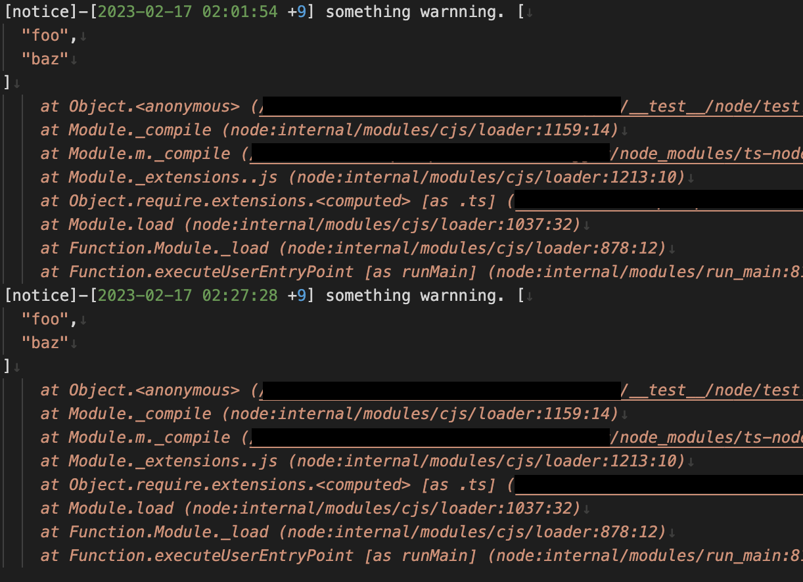

# white-logger

A very simple nodejs and browser logger with only one dependency.

white-logger is now released in statable version 1.0.0

And there is a BREAKING CHANGE, please see [this document](./docs/nodelogger/migrate.md) for details.

# feature

- Only one dependency. Use [Luxon](https://moment.github.io/luxon/#/) for dealing with dates and times.
- Pretty print.
- Native TypeScript.
- Circular safe.

# install

```bash
npm i white-logger
```

# useage

## nodejs

### use typescript or ESM

```typescript
import { nodelogger as logger } from "white-logger/node";

logger.normal("normal-level", "normal reported.");
logger.info("info here", "something reported.", {
  hello: "world",
});
logger.warn("notice", "something warnning.", ["foo", "baz"]);
logger.err("oops!", "something error!");
```

You will get like this in your console.


By default, white-logger will automatically tracks all calls and print them. Easy to find out the problem, right?

And white-logger can also automatically output logs to a file. If you want to do this, please configure some setting like this.

```typescript
import { nodelogger as logger, configLogger } from "white-logger/node";
import path from "path";

// By setting the logPath option, white-logger will write the log to files automatically.
configLogger({
  logPath: path.resolve(process.cwd(), "logs"),
});

// Will be written to <project_root>/logs/<timestamp>_info.log
logger.info("some-info", "something reported.");
```

**Depending on the level, the logs will be written to different files.**

- `logger.normal` will write to `<timestamp>_normal.log`
- `logger.info` will write to `<timestamp>_info.log`
- `logger.warn` will write to `<timestamp>_warn.log`
- `logger.err` will write to `<timestamp>_err.log`

Timestamp will change from day to day. So, the logs are output to a different file each day.

You can also only pass a relative path, white-logger will resolve it to your project root directory automatically.

```typescript
configNodeLogger({
  // Same as above, logs will write to <project_root_dir>/logs
  logPath: "logs",
});
```

If you config a file output, you will get something like this.



If you don't want auto-tracking to fill up your entire console, you can also turn it off when in development mode.

```ts
configNodeLogger({
  // This will only work on development mode.
  // In production mode, The trace is forced to be output.
  trace: false,
});
```

### use CommonJS

```javascript
const { nodelogger } = require("white-logger/node");

nodelogger.normal("normal-level", "normal reported.");
```

You can also import with a name of your choice.

```javascript
const mylogger = require("white-logger/node").nodelogger;

mylogger.normal("normal-level", "normal reported.");
```

---

## browser

You can use white-logger in any framework. Like vue or react.

```javascript
// Please note that the esm module is in esm directory.
import { browserlogger as logger } from "white-logger/esm/browser";

logger.normal("normal-level", "normal reported.");
logger.info("info here", "something reported.", {
  hello: "world",
});
logger.warn("notice", "something warnning.", ["foo", "baz"]);
logger.err("oops!", "something error!");
```

Open your console and you can see the results.


You can use `configBrowserLogger` function to configure your browser logger.

```typescript
import { configBrowserLogger } from "white-logger/esm/browser";

configBrowserLogger({
  mode: "production",
  targetUrl: undefined,
  storagePrefix: undefined,
});
```

By default, browser logger running in development mode.

- In development mode, browser logger will print log to console.
- In production mode, will _NOT_ print to console, but will do diffrently depending on the `targetUrl` or `storage` config.
  - If targetUrl defined, browser logger will post log to given url by use fetch api.
  - If storage defined, browser logger will save log into localStorage with given prefix string.
  - For more information, please see [this document](docs/browserlogger/index.md).

# configuration

## node logger

```typescript
export type NodeLoggerConfig = {
  logPath?: string; // full or relative path to your logs directory
  logDateFmt: string; // Luxon format string
  filenameDateFmt: string; // Luxon format string
  trace?: boolean;
};

// default value
let __config__: NodeLoggerConfig = {
  logPath: undefined,
  logDateFmt: "yyyy'-'LL'-'dd HH':'mm':'ss Z",
  filenameDateFmt: "yyyy'-'LL'-'dd",
  trace: true,
};
```

About Luxon format string, please see [this Luxon document](https://moment.github.io/luxon/#/formatting?id=table-of-tokens)

- `logPath`: The path of directory that white-logger will write log to.
- `logDateFmt`: The format of the date being printed to the console.
- `filenameDateFmt`: The format of the date before being inserted into the output file.
- For more infomation please see [nodelogger document](docs/nodelogger/index.md)

## browser logger

```typescript
export type BrowserLoggerConfig = {
  mode: "development" | "production"; // browser logger mode
  logDateFmt: string; // luxon date format string
  targetUrl?: string; // fetch post url
  storagePrefix?: string; // localStorage item key prefix
  trace?: boolean;
};

// default value
let __config__: BrowserLoggerConfig = {
  mode: "development",
  logDateFmt: "yyyy'-'LL'-'dd HH':'mm':'ss Z",
  targetUrl: undefined,
  storagePrefix: undefined,
  trace: true
};
```

About Luxon format string, please see [this Luxon document](https://moment.github.io/luxon/#/formatting?id=table-of-tokens)

- `mode`: browser logger mode. For more information on the differences between the two modes of blogger please see [this document](docs/browserlogger/index.md#mode).
- `logDateFmt`: The format of the date being printed to the console.
- `targetUrl`: Post url in production mode.
- `storagePrefix`: localStorage prefix in production mode.
- For more information, please see [this document](docs/browserlogger/index.md)

# Why is it call White logger?

> "Any color you want, so long as it is Black."

So, White logger.
