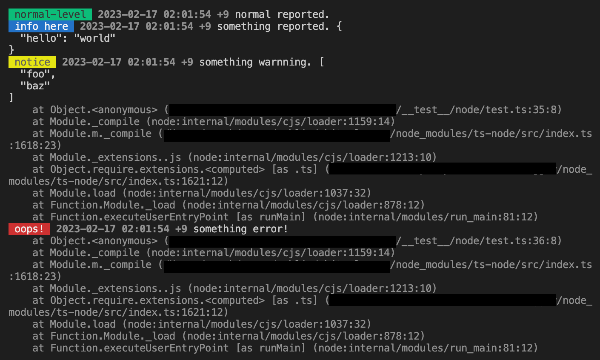

# white-logger

A very simple nodejs and browser logger with only one dependency.

🚧 NOTICE: white-logger is currently in beta. There may be frequent updates that are not backwards compatible. Please keep an eye on our [update docs](docs/release_notes/updates.md).

We expect to release a stable version of 1.0.0 in 02/2023.

# feature

- Only one dependency. Use [Luxon](https://moment.github.io/luxon/#/) for dealing with dates and times.
- Pretty print.
- Native TypeScript.
- Circular safe.

# install

```bash
npm i white-logger
```

# useage

## nodejs

### use typescript or ESM

```typescript
import { nodelogger as logger } from "white-logger/node";

logger.normal("normal-level", "normal reported.");
logger.info("info here", "something reported.", {
  hello: "world",
});
logger.warn("notice", "something warnning.", ["foo", "baz"]);
logger.err("oops!", "something error!");
```

You will get like this in your console.



You can also give `__filename` to the second parameter to get relative path output from your project root dir.

```typescript
import { nodelogger as logger } from "white-logger/node";

logger.info("some info", __filename, "i am here!");
```

And you will get like this. Easy to find out the problem, right?


By default, white-logger does not write log to files. If you want to do this, please configure some setting like this.

```typescript
import { nodelogger as logger, configLogger } from "white-logger/node";
import path from "path";

// By setting the logPath option, white-logger will write the log to files automatically.
configLogger({
  logPath: path.resolve(process.cwd(), "logs"),
});

// Will be written to <project_root>/logs/<timestamp>_info.log
logger.info("some-info", "something reported.");
```

**Depending on the level, the logs will be written to different files.**

- `logger.normal` will write to `<timestamp>_normal.log`
- `logger.info` will write to `<timestamp>_info.log`
- `logger.warn` will write to `<timestamp>_warn.log`
- `logger.err` will write to `<timestamp>_err.log`

Timestamp will change from day to day. So, the logs are output to a different file each day.

You can also only pass a relative path, white-logger will resolve it to your project root directory automatically.

```typescript
configNodeLogger({
  // Same as above, logs will write to <project_root_dir>/logs
  logPath: "logs",
});
```

### use CommonJS

```javascript
const { nodelogger } = require("white-logger/node");

nodelogger.normal("normal-level", "normal reported.");
```

You can also import with a name of your choice.

```javascript
const mylogger = require("white-logger/node").nodelogger;

mylogger.normal("normal-level", "normal reported.");
```

---

## browser

You can use white-logger in any framework. Like vue or react.

```javascript
// Please note that the esm module is in esm directory.
import { browserlogger as logger } from "white-logger/esm/browser";

logger.normal("normal-level", "normal reported.");
logger.info("info here", "something reported.", {
  hello: "world",
});
logger.warn("notice", "something warnning.", ["foo", "baz"]);
logger.err("oops!", "something error!");
```

Open your console and you can see the results.


# configuration

```typescript
export type white-loggerConfig = {
  logPath: string | undefined; // full or relative path to your logs directory
  logDateFmt: string; // Luxon fmt string
  filenameDateFmt: string; // Luxon fmt string
};

// default value
let __config__: white-loggerConfig = {
  logPath: undefined,
  logDateFmt: "yyyy'-'LL'-'dd HH'-'mm'-'ss Z",
  filenameDateFmt: "yyyy'-'LL'-'dd",
};
```

About Luxon fmt string, please see [this Luxon document](https://moment.github.io/luxon/#/formatting?id=table-of-tokens)

- `logPath` The path of directory that white-logger will write log to.
- `logDateFmt` The format of the date being printed to the console.
- `filenameDateFmt` The format of the date before being inserted into the output file.

# Why is it call White logger?

> "Any color you want, so long as it is Black."

So, White logger.
