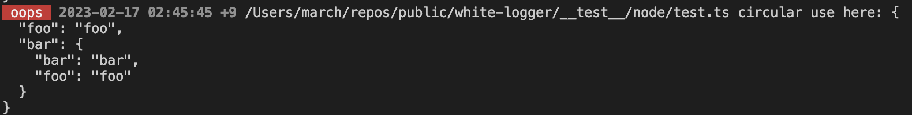

# migrate to v1.0.x from v0.2.x

- Just remove `__filename` from the second parameter.
  - Although it works fine without remove `__filename`, but the output will become a bit ugly like this.
  
- Now browser-logger will send one more timestamp to server on production mode.
  - now:
    ```ts
    export type BrowserPostBody = {
      level: string;
      prefix: string;
      msg: unknown;
      isotime: string; // this is the new one.
    };
    ```
  - So you need to handle this or just ignore it.
